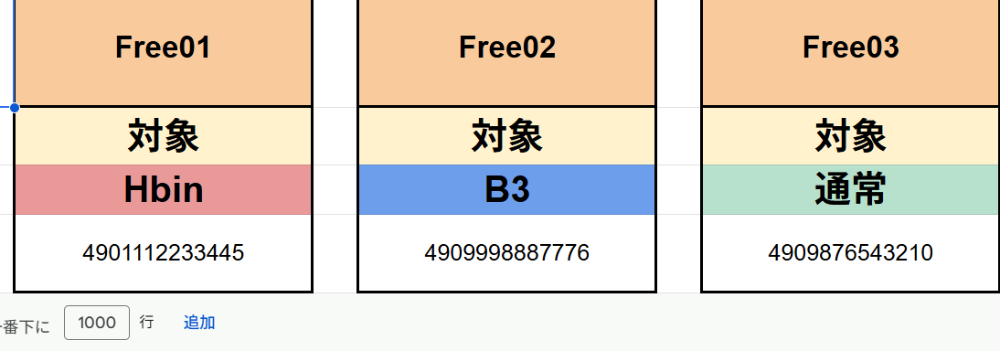

# 危険庫判定ツール

## 概要

受領業務で発生していた危険庫判定の誤判定リスクを解消するために再設計した判定ツール。
従来のCOUNTIFベース運用をARRAYFORMULA中心の構造へ変更し、上書き事故の防止と保守性向上を実現した。

---

## 開発背景

受領作業では商品データをもとに危険庫対象かどうかをスキャナーで1件ずつ確認していたが、
入力枠が判定セルの直下にあったため、連続スキャン操作で入力値が関数を上書きする問題があった。  
また複数人が同時に使用した際にJANが上書きされると、誤った判定結果を見てしまうリスクがあった。  
そのため、個別かつ一括で判定処理ができる仕組みへの再設計が必要と判断した。

---

## 課題

- 入力枠が判定セルの直下にあり、連続スキャンで関数が上書きされることがあった
- 同時使用時のJAN上書きにより、誤った判定結果を見るリスクがあった

---

## 実装内容

### 判定ロジックの再設計

COUNTIFベースの判定ロジックを廃止し、ARRAYFORMULAによる列単位の自動判定へ移行。  
個別入力から一括判定処理へ変更し、上書きによる誤判定リスクを排除した。

### データ構造の整理

VSTACK / HSTACKを活用してデータ構造を整理。  
入力データと判定ロジックを分離し、条件追加時の修正箇所を最小化した。

### ロジックの再利用性向上

LET / LAMBDAを活用し、判定処理を変数化・モジュール化。  
複雑な条件式を分解し、可読性と再利用性を向上させた。

---

## 使用技術

| 技術 | 用途 |
|------|------|
| Google Spreadsheet | データ管理・判定処理 |
| ARRAYFORMULA | 列単位の一括自動判定 |
| VSTACK / HSTACK | データ構造の整理・統合 |
| LET / LAMBDA | 処理の変数化・再利用性向上 |
| MAKEARRAY / IFERROR | 配列生成・例外処理 |
| Spreadsheet関数設計 | 判定ロジックの一元化 |

---

## アーキテクチャ

本ツールは「何を使ったか」ではなく「なぜこの構造にしたか」を意識し、以下の4層構造で設計した。

```mermaid
flowchart TD
    A["**フレームワーク層（LET / LAMBDA）**\n──────────────────────────────\n処理全体の構造制御・再利用性の確保"]
    B["**データ生成・構造構築層**\n──────────────────────────────\n動的ラベル生成・表示用データの組み立て"]
    C["**業務ロジック層**\n──────────────────────────────\nリスト照合・区分判定・判定ルールの統合"]
    D["**レイアウト・出力制御層**\n──────────────────────────────\n最終シートへの統合出力"]
    A --> B --> C --> D
    style A fill:#dbeafe,stroke:#3b82f6,stroke-width:2px,color:#1e3a5f
    style B fill:#dcfce7,stroke:#22c55e,stroke-width:2px,color:#14532d
    style C fill:#fef9c3,stroke:#eab308,stroke-width:2px,color:#713f12
    style D fill:#fce7f3,stroke:#ec4899,stroke-width:2px,color:#831843
```

## 画面イメージ

---

## 効果

- 上書きによる誤判定リスクを排除
- 受領担当者全員が利用する標準ツールとして定着
- 千葉拠点へ展開し、横展開に成功
- 判定ロジックの一元化により管理コストを削減

---

## 担当範囲

現場業務の課題発見から設計、開発、運用まで一貫して担当。

---

## 工夫した点

- COUNTIFベースの行単位処理を廃止し、ARRAYFORMULAによる一括判定へ変更することで上書き事故を防止した
- LET / LAMBDAを活用し、判定ロジックを関数内へ集約することで誤編集リスクを低減した
- 入力データと判定ロジックを分離し、保守性と拡張性を向上させた
